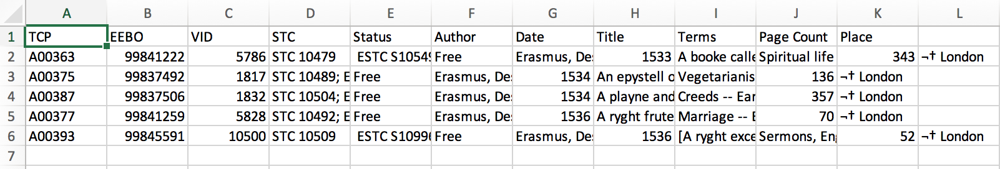

Materials by: **Jeffrey Hollister**, **Alexander Duryee**, **Jennifer Bryan**, **Daisie Huang**, **Ben Marwick**, **Christie Bahlai**, **Owen Jones**, **Aleksandra Pawlik**

# Learning Objectives
* Identify problems with using the .csv file format.
* Apply best practices for data cleaning to avoid problems with the .csv file format.

###Commas as part of data values in `*.csv` files

In the [previous lesson](05-exporting-data.md) we discussed how to export Excel file formats into `*.csv`. Whilst Comma Separated Value files are indeed very useful allowing for easily exchanging and sharing data. 

However, there are some significant problems with this particular format. Quite often the data values themselves may include commas (,). In that case, the software which you use (including Excel) will most likely incorrectly display the data in columns. It is because the commas which are a part of the data values will be interpreted as a delimiter.

For example, our data could look like this:
	
TCP,EEBO,VID,STC,Status,Author,Date,Title,Terms,Page Count,Place
A00363,99841222,5786,STC 10479, ESTC S105494,Free,"Erasmus, Desiderius, d. 1536.; Tyndale, William, d. 1536.",1533,"A booke called in latyn Enchiridion militis christiani, and in englysshe the manuell of the christen knyght replenysshed with moste holsome preceptes, made by the famous clerke Erasmus of Roterdame, to the whiche is added a newe and meruaylous profytable preface.; Enchiridion militis Christiani. English","Spiritual life -- Modern period, 1500-.",343,  London
A00375,99837492,1817,STC 10489; ESTC S101684,Free,"Erasmus, Desiderius, d. 1536.",1534,"An epystell of ye famous doctor Erasm[us] of Roterdam vnto the reuerende father & excellent prince, Christofer bysshop of Basyle, co[n]cernyng the forbedynge of eatynge of flesshe, and lyke constitutyons of men. &c.; De interdicto esu carnium. English",Vegetarianism -- Religious aspects -- Early works to 1800.,136,  London
A00387,99837506,1832,STC 10504; ESTC S101698,Free,"Erasmus, Desiderius, d. 1536.; Marshall, William, fl. 1535.",1534,"A playne and godly exposytion or declaratio[n] of the co[m]mune crede (which in the Latin tonge is called Symbolum Apostolorum) and of the. x. co[m]maundementes of goddes law, newly made and put forth by the famouse clarke, Mayster. Erasmus of Roterdame, at the requeste of the moste honorable lorde, Thomas Erle of wyltshyre: father to the moste gratious and vertuous Quene Anne wyf to our most gracyous soueraygne lorde kynge Henry the. viii. Cum priuilegio.; Catechismus. English",Creeds -- Early works to 1800.; Ten commandments -- Early works to 1800.,357,  London
A00377,99841259,5828,STC 10492; ESTC S105531,Free,"Erasmus, Desiderius, d. 1536.; Taverner, Richard, 1505?-1575.",1536,"A ryght frutefull epystle, deuysed by the moste excellent clerke Erasmns [sic], in laude and prayse of matrymony, translated in to Englyshe, by Rychard Tauernour, which translation he hathe dedicate to the ryght honorable Mayster Thomas Cromwel most worthy counseloure to our souerayne lorde kyng Henry the eyght. Cum priuilegio regali; Matrimonii encomium. English",Marriage -- Early works to 1800.,70,  London
A00393,99845591,10500,STC 10509, ESTC S109962,Free,"Erasmus, Desiderius, d. 1536.",1536,[A ryght excellent sermon and full of frute and edificacyon of the chylde Jesus.]; Concio de puero Jesu. English,"Sermons, English -- 16th century.",52,  London

In record beginning A00393 the value for *STC* includes a comma (`STC 10509, ESTC S109962`). 
If we try to read the above into Excel (or other spreadsheet programme), we will get something like this:

The value for 'taxa' was split into two columns (instead of being put in one column `D`). This can propagate to a number of further errors. For example, the "extra" column will be interpreted as a column with many missing values (and without a proper header!). In addition to that, the value in column `D` for the record in row 3 (so the one where the value for 'taxa' contained the comma) is now incorrect. 
 

### Dealing with commas as part of data values in `*.csv` files

If you want to store your data in `*.csv` and expect that your data may contain commas in their values, you can avoid the problem discussed above by putting the values in quotes (""). This [example data file](./data/biology/species.csv) applies this rule so the actual data looks like:

TCP,EEBO,VID,STC,Status,Author,Date,Title,Terms,Page Count,Place
A00363,99841222,5786,"STC 10479; ESTC S105494",Free,"Erasmus, Desiderius, d. 1536.; Tyndale, William, d. 1536.",1533,"A booke called in latyn Enchiridion militis christiani, and in englysshe the manuell of the christen knyght replenysshed with moste holsome preceptes, made by the famous clerke Erasmus of Roterdame, to the whiche is added a newe and meruaylous profytable preface.; Enchiridion militis Christiani. English","Spiritual life -- Modern period, 1500-.",343,  London
A00375,99837492,1817,"STC 10489; ESTC S101684",Free,"Erasmus, Desiderius, d. 1536.",1534,"An epystell of ye famous doctor Erasm[us] of Roterdam vnto the reuerende father & excellent prince, Christofer bysshop of Basyle, co[n]cernyng the forbedynge of eatynge of flesshe, and lyke constitutyons of men. &c.; De interdicto esu carnium. English",Vegetarianism -- Religious aspects -- Early works to 1800.,136,  London
A00387,99837506,1832,"STC 10504; ESTC S101698",Free,"Erasmus, Desiderius, d. 1536.; Marshall, William, fl. 1535.",1534,"A playne and godly exposytion or declaratio[n] of the co[m]mune crede (which in the Latin tonge is called Symbolum Apostolorum) and of the. x. co[m]maundementes of goddes law, newly made and put forth by the famouse clarke, Mayster. Erasmus of Roterdame, at the requeste of the moste honorable lorde, Thomas Erle of wyltshyre: father to the moste gratious and vertuous Quene Anne wyf to our most gracyous soueraygne lorde kynge Henry the. viii. Cum priuilegio.; Catechismus. English",Creeds -- Early works to 1800.; Ten commandments -- Early works to 1800.,357,  London
A00377,99841259,5828,"STC 10492; ESTC S105531",Free,"Erasmus, Desiderius, d. 1536.; Taverner, Richard, 1505?-1575.",1536,"A ryght frutefull epystle, deuysed by the moste excellent clerke Erasmns [sic], in laude and prayse of matrymony, translated in to Englyshe, by Rychard Tauernour, which translation he hathe dedicate to the ryght honorable Mayster Thomas Cromwel most worthy counseloure to our souerayne lorde kyng Henry the eyght. Cum priuilegio regali; Matrimonii encomium. English",Marriage -- Early works to 1800.,70,  London
A00393,99845591,10500,"STC 10509; ESTC S109962",Free,"Erasmus, Desiderius, d. 1536.",1536,[A ryght excellent sermon and full of frute and edificacyon of the chylde Jesus.]; Concio de puero Jesu. English,"Sermons, English -- 16th century.",52,  London
	
This original file does not contain commas in the values. 

But let's see what would happen if we introduced a comma into  `"Rodent-not censused"` - so that it looks like this: `"Rodent-not, censused"`. 

1. Open the [stccomma.csv](./data/humanities/stccomma.csv) file in Excel (or Calc in Libre Office).
2. Add the comma (,) in `"STC 10509; ESTC S109962"`.
3. Save the file under a **different name** (but also in the `csv` format) and reopen it in Excel.
4. The issue with the "extra" incorrect column should not appear.

However, if you are working with already existing dataset in which the data values are not included in "" and but which have commas as both delimiters and parts of data values, you are potentially facing a major problem with **data cleaning**.

If the dataset you're dealing with contains hundreds or thousands of records, cleaning them up manually (by either removing commas from the data values or putting the values into quotes - "") is not only going to take hours and hours but may potentially end up with you accidentally introducing many errors.

Cleaning up datasets is one of major problems in many humanities disciplines. The approach almost always depends on the particular context. However, it is a good practice to clean the data in an automated fashion, for example by writing and running a script. Other lessons in Data Carpentry covering shell, Python and R will give you the basis for developing skills to build relevant scripts.

###Tab Separated Values format

###Other delimiters for data formats

Previous: [Exporting data from spreadsheets.](05-exporting-data.html)
