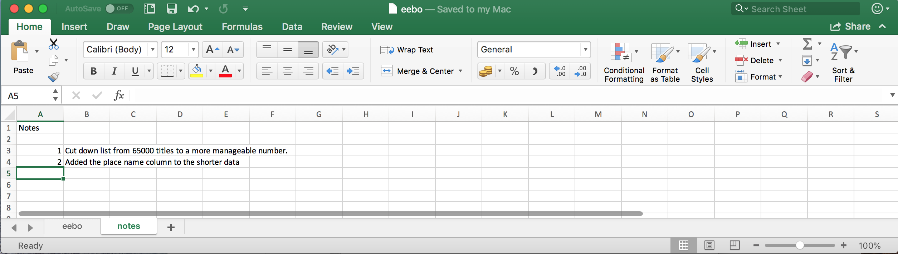

Authors: **Christie Bahlai**, **Aleksandra Pawlik** 

The most common mistake made is treating spreadsheet programs like notebooks, that is, 
relying on context, notes in the margin,
spatial layout of data and fields to convey information. As humans, we
can (usually) interpret these things, but computers don't view information the same way, and
unless we explain to the computer what every single thing means (and
that can be hard!), it will not be able to see how our data fit
together.

Using the power of computers, we can manage and analyze data in much more 
effective and faster ways, but to use that power, we have to set up
our data for the computer to be able to understand it (and computers are very 
literal).

This is why it’s extremely important to set up well-formatted
tables from the outset - before you even start entering data from
your very first preliminary experiment. Data organization is the
foundation of your research project. It can make it easier or harder
to work with your data throughout your analysis, so it's worth
thinking about when you're doing your data entry or setting up your
experiment. You can set things up in different ways in spreadsheets,
but some of these choices can limit your ability to work with the data in other programs or
have the you-of-6-months-from-now or your collaborator work with the
data.

> Note: the best layouts/formats (as well as software and
> interfaces) for data entry and data analysis might be
> different. It is important to take this into account, and ideally
> automate the conversion from one to another.

### Keeping track of your analyses

When you're working with spreadsheets, during data clean up or analyses, it's
very easy to end up with a spreadsheet that looks very different from the one
you started with. In order to be able to reproduce your analyses or figure out
what you did when Reviewer #3 asks for a different analysis, you should

- create a new file or tab with your cleaned or analyzed data. Don't modify
the original dataset, or you will never know where you started!
- keep track of the steps you took in your clean up or analysis. You should track 
these steps as you would any step in an experiment. You can
do this in another text file, or a good option is to create a new tab in your spreadsheet
with your notes. This way the notes and data stay together.

This might be an example of a spreadsheet setup:

Put these principles in to practice today during your Exercises. 

### Structuring data in spreadsheets

The cardinal rules of using spreadsheet programs for data:

1. Put all your variables in columns - the thing you're measuring,
   like 'Date' or 'Authors'.
2. Put each observation in its own row.
3. Don't combine multiple pieces of information in one
   cell. Sometimes it just seems like one thing, but think if that's
   the only way you'll want to be able to use or sort that data.
4. Leave the raw data raw - don't change it!
5. Export the cleaned data to a text-based format like CSV (comma-separated values) format. This
   ensures that anyone can use the data, and is required by
   most data repositories.

For instance, we have data from tests encoded into XML in a long runing project. 
Different people have added texts and data was entered into a spreadsheet later. 
They keep track of things like authors, page length, terms and date published.

A problem is that all authors are in the same field. So, if they wanted to 
look at all of one author or look at different publication date by author, 
it would be hard to do this using this data setup. If instead we put authors 
in different columns, you can see that it would be much easier. 

### Columns for variables and rows for observations

The rule of thumb, when setting up a datasheet, is columns =
variables, rows = observations, cells = data (values).

So, instead we should have:

> ## Discussion
> If not already discussed, introduce the dataset that will be used in this
> lesson, and in the other humanities lessons, the [Early English Books Online/Text Creation Partnership](https://github.com/iaine/humanities-lesson-data/data/spreadsheet/tcp_spreadsheet.csv). 
>
> The data used in the Humanities lessons are the metadata catalogue for the EEBO/TCP books that have been formatted into Text Encoding Initiative (TEI) files.
> 
{: .discussion}

> ## Exercise
> 
> We're going to take a messy version of the catalogue data and describe how we would clean it up.
>
> 1. Download the data by clicking [here](https://github.com/iaine/humanities-lesson-data/data/spreadsheet/tcp_spreadsheet.csv) to get it from Github.
> 2. Open up the data in a spreadsheet program. 
> 3. With the person next to you, identify what is wrong with this spreadsheet. 
>
> **Important** Do not forget our first piece of advice, the
> create a new file (or tab) for the cleaned data, never
> modify your original (raw) data.
> 
> After you go through this exercise, we'll discuss as a group what was wrong
> with this data and how you would fix it. 
> 
> > ## Solution
> > - Take about 10 minutes to work on this exercise.
> > - All the mistakes in [02-common-mistakes](../02-common-mistakes) are present in the messy dataset. If
> > exercise is done during a workshop, ask people what they saw as wrong with
> > the data. As they bring up different points, you can refer to [02-common-mistakes](../02-common-mistakes)
> > or expand a bit on the point they brought up.
> > - If you get a response where they've fixed the date, you can pause and go to the [03-dates-as-data](../03-dates-as-data) lesson. Or you can say you'll come back to dates at the end. 
> {: .solution}
{: .challenge}

An excellent reference, in particular with regard to R scripting is

> Hadley Wickham, *Tidy Data*, Vol. 59, Issue 10, Sep 2014, Journal of
> Statistical Software. [http://www.jstatsoft.org/v59/i10](http://www.jstatsoft.org/v59/i10).

